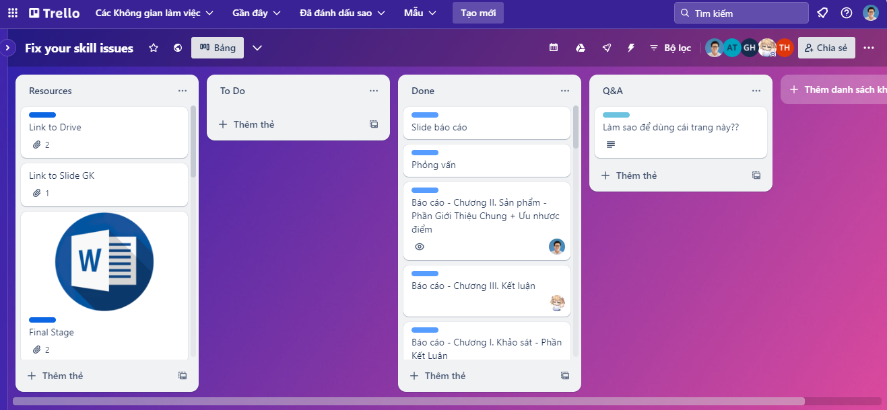

# SS004 – Professional Skills Seminar and Project

📋 **Trello Workspace:**  
🔗 [Fix Your Skill Issues – Trello Board](https://trello.com/b/huYZ5slC/fix-your-skill-issues)

   
   
<strong>Project Management Workspace Overview</strong>

---

## 🎤 Seminar Topic

- **Thinking Skill** – A session focused on developing critical and creative thinking abilities essential for professional growth.

---

## 🍽️ Food Safety Project

### 🔎 Midterm Deliverables
- **Survey** – Data collection from target users regarding food safety awareness.  
- **Presentation Slide** – Midterm project overview.  
- **Product Trailer** – Short teaser video introducing the food safety topic and goals.

### 📌 Final Deliverables
- **Final Report** – Comprehensive documentation of the project’s objectives, process, and findings.  
- **Presentation Slide** – Final presentation for evaluation.  
- **Survey** – Summary and analysis of collected user feedback.  
- **Interview** – Conducted with relevant individuals to gather real-world insights.  
- **Completed Product Video** – Final edited video product demonstrating the project outcome.

---

## 📚 References

1. M.S. Rao. *Soft Skills for Students—Classroom to Corporate*. Jaipur, Rajasthan, India.  
2. BEST Soft Skills Training Program: [http://best.edu.vn](http://best.edu.vn)  
3. PACE Institute of Management: [http://www.pace.edu.vn/vn/dao-tao](http://www.pace.edu.vn/vn/dao-tao)
